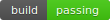
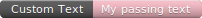
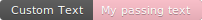
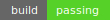
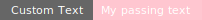
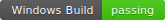
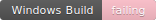

# Embeddable Build Status Plugin

This plugin provides customizable badges (similar to [shields.io](https://shields.io)) to any website.

For each variant there are two URLs available for inclusion:
- **protected** exposes the badge to users having at least `Read` permission on the job:

  Example: \
  `http://<jenkinsroot>/path/to/job/badge/icon?...` <small>(for jobs)</small> \
  `http://<jenkinsroot>/path/to/job/<buildNumber>/badge/icon?...` <small></small>(for builds)

  If you omit any query parameter the default badge for the job/build will be returned:

  
  
- **unprotected**  exposes the badge to users having at least `ViewStatus` permission on the job

  Example: `http://<jenkinsroot>/buildStatus?...`

  To select a specific job and build use the query parameters [job](#job) and [build](#build)

Customization can be done via query parameters.

# Query Parameters
## `style`
Four basic types are supported:
### *plastic*
 (default)

 (customized)

### *flat* (default)
 (default)

 (customized)

### *flat-square*
 (default)

 (customized)

### *ball-&lt;size&gt;*
This style returns the standard Jenkins "balls".

Supported sizes are: `16x16`, `24x24`, `32x32` and `48x48` (and probably more... just try).

*Examples:* `ball-16x16` or `ball-32x32`

**Note:** If you are using this style **all other query parameters** will have **no effect**.

## `config`
You can add pre-customized badge configurations via pipeline script (see **"DSL"** below).

## `subject` and `status`
The customized examples above uses the following query parameters:

`?subject=Custom Text&status=My passing text`

## `color` and `animatedOverlayColor`

You can override the color using the following valid color values:
- one of the values: `red`, `brightgreen`, `green`, `yellowgreen`, `yellow`, `orange`, `lightgrey`, `blue`
- a valid hexadecimal HTML RGB color <b>without</b> the hashtag (e.g. `FFAABB`).
- any valid [SVG color name](https://www.december.com/html/spec/colorsvg.html)

## `job`
**Note: This parameters is only supported for the unprotected URL!** 

The path for the selected job **or**
any selector implemented via `JobSelectorExtensionPoint`

If you omit this parameter you can customize any "untethered" badge you like.

**Important**

The job selector string **must** be URL escaped. \
If you are using <b>Multibranch Pipelines</b> the <b>branch</b> within the selector needs to be URL encoded <b style="color: red">twice</b>.

*Example* \
<code>?job=<span style="color: blue">path/to/job</span>/branch/path</code> <b style="color: red">&#10060;</b> \
would become\
<code>?job=<span style="color: blue">path%2Fto%2Fjob</span>%2Fbranch<b style="color: red">%252F</b>path</code> <b style="color: green">&#10004;</b>

##### *ExtensionPoint* 
This plugin provides a `JobSelectorExtensionPoint` which allow for custom job selector implementations.

## `build`
Select the build. 

### *Notes*
- This parameter is supported for the protected **and** unprotected URL! 
- For the unprotected URL use the [job](#job) parameter is also required!

### *Selectors*
Allowed selectors are:

- Build-ID (`integer`)
- relative negative Build-Index (`0` = last, `-1` = previous, `-2` ...)
- Selector via the following Rule:

  `(last|first)[Failed|Successful|Unsuccessful|Stable|Unstable|Completed][:${params.<BuildParamerName>=<BuildParameterValue>}]`

  - `(...)` is required
  - `[...]` is optional

  Examples:
  - `last`
  - `first`
  - `lastStable`
  - `firstCompleted`
  - `lastSuccessful:${params.BRANCH=master}`
  
##### *ExtensionPoint*
This plugin provides a `RunSelectorExtensionPoint` which allow for custom run selector implementations.

### *Concatenation*

All those selectors can be concatenated as comma separated list:

`build=last,-10,firstSuccessful:${params.BRANCH=master}`

This searches in the last `10` runs for the first successful build of the `master` branch (provided the Build Parameter `BRANCH` exists).

**Note:** If you are using <b>Multibranch Pipelines</b> the <b>branch name</b> within the selector needs to be URL encoded <b style="color: red">twice</b> (see [job](#job) for further information).

## `link`
Provide a link to be opened on clicking on the badge.

# Parameter Resolver
The query parameters `subject`, `status`, `color`, `animatedOverlayColor` and `link` support the usage of variables like `?subject=Build ${variable}`

Available builtin variables are:
 - `buildId`, `buildNumber`, `displayName`, `description`, `duration`, and `startTime`
 - `params.<BuildParameterName>` where `<BuildParameterName>` matches any Parameter used for running the job.

   **Note:** If the build parameter is not set you can use the following syntax to use a fallback value:
   `params.<BuildParameterName>|<FallbackValue>`
 
Example: `?subject=Build ${params.BUILD_BRANCH|master} (${displayName})`

##### *ExtensionPoint*
This plugin provides a `ParameterResolverExtensionPoint` which allow for custom `${<Parameter>}` resolver implementations.
# DSL 

```groovy
/**
 * Adds a badge configuration with the given id.
 * minimal params
 * 
 * id: A unique id for the configuration
 */
addEmbeddableBadgeConfiguration(id: <id>)

/**
 * all params
 * 
 * id: A unique id for the configuration
 * subject: A subject text
 * status: A status text
 * color: A valid color (RGB-HEX: RRGGBB or valid SVG color name)
 * animatedOverlayColor: A valid color (RGB-HEX: RRGGBB or valid SVG color name)
 * link: The link to be opened upon clicking.
 */
addEmbeddableBadgeConfiguration(id: <string>, subject: <string>, status: <string>, color: <string>, animatedOverlayColor: <string>, link: <string>)
```

This function returns a configuration object.

#### Example
```groovy
def win32BuildBadge = addEmbeddableBadgeConfiguration(id: "win32build", subject: "Windows Build")

def RunBuild() {
    echo 'Sleeping instead of running the build'
    sleep 10
}

pipeline {
    agent any
    stages {
        stage('Building') {
            steps {
                script {
                    win32BuildBadge.setStatus('running')
                    try {
                        RunBuild()
                        win32BuildBadge.setStatus('passing')
                    } catch (Exception err) {
                        win32BuildBadge.setStatus('failing')

                        /* Note: If you do not set the color
                                 the configuration uses the best status-matching color.
                                 passing -> brightgreen
                                 failing -> red
                                 ...
                        */
                        win32BuildBadge.setColor('pink')
                        error 'Build failed'
                    }
                }
            }
        }
    }
}
```

You can use the `config` query parameter to reference the `win32build` id:

`http://<jenkinsroot>/path/to/job/<buildNumber>/badge/icon?config=win32build`

`http://<jenkinsroot>/buildStatus/icon?job=...&build=...&config=win32build`




